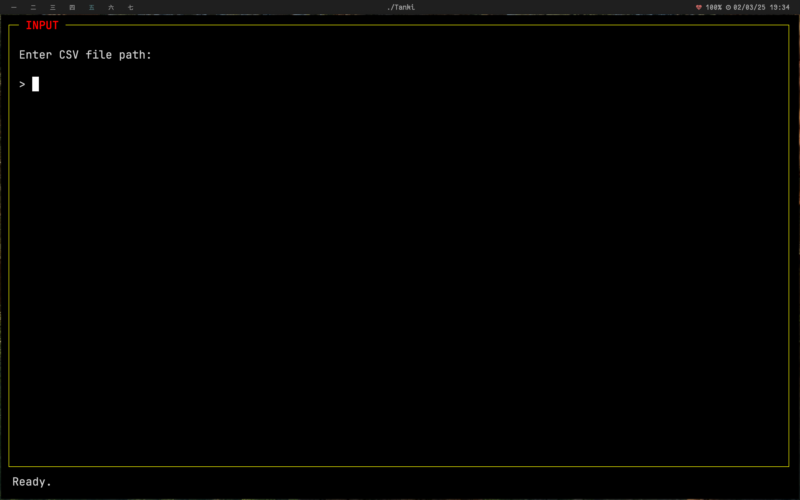

# Tanki - Terminal-Based Spaced Repetition System

Tanki is a **terminal-based flashcard application** inspired by Anki, built using **ncurses**.  
It supports **spaced repetition**, **multiple decks**, **CSV import**, **card deletion**, and more.


## ✨ Features

- **Terminal-based UI with ncurses**
- **Spaced repetition using the SM-2 algorithm**
- **Multiple decks stored in `~/.tanki_decks/`**
- **Import cards from CSV (with duplicate detection)**
- **Delete individual cards**
- **Browse and search through cards**
- **Review due cards and track progress**
- **Cram mode for quick studying without affecting scheduling**
- **Colored UI elements for better readability**

---

## 🔧 Installation

### **1. Install Dependencies**
#### **macOS**
```sh
brew install ncurses cmake
```
#### **Ubuntu / Debian**
```sh
sudo apt install libncurses-dev cmake
```

### **2. Clone the Repository**
```sh
git clone https://github.com/yourusername/tanki.git
cd tanki
```

### **3. Build the Application**
```sh
mkdir build
cd build
cmake ..
make
```

### **4. Run Tanki**
```sh
./Tanki
```

---

## 🎮 Usage

When you launch Tanki, you will see a **welcome screen** showing existing decks.  
You can **select a deck**, **create a new one**, or **quit**.

### **📌 Main Menu Shortcuts**
| Key | Action |
|-----|--------|
| `r` | Review due cards |
| `c` | Cram mode (study without scheduling) |
| `b` | Browse all cards |
| `i` | Import CSV file |
| `x` | Delete a card |
| `t` | View statistics |
| `s` | View upcoming schedule |
| `d` | Switch to a different deck |
| `n` | Create a new deck |
| `?` | Show help screen |
| `q` | Quit the program |

---

## 📂 Importing Cards from CSV

To add cards, create a CSV file with **two columns**:  

```csv
front_text,back_text
"What is the capital of France?","Paris"
"What is the largest planet?","Jupiter"
"Who wrote '1984'?","George Orwell"
```

Save this as `cards.csv` and import it using the **`i`** key from the **main menu**.

---

## 🛢️ Deleting a Card

To delete a card:
1. Press **`x`** in the main menu.
2. A **paginated list** of cards will be displayed.
3. Select a card **by its number** to delete it permanently.

---

## 💽 File Storage

Tanki **stores all decks** in:
```
~/.tanki_decks/
```
Each deck is saved as a `.deck` file.

---

## 🛠️ Troubleshooting

### **Blank Screen After Selecting a Deck**
- Make sure your **terminal supports ncurses**.
- Try **resizing the terminal window**.
- Press **`q`** to exit and **restart the program**.

### **Input Lag or UI Freezing**
- Run this command **before launching Tanki**:
  ```sh
  reset
  ```
- Ensure **no other ncurses-based programs** are interfering.

---

## 📝 License

Tanki is open-source software. You are free to **modify, distribute, and improve** it.

---

## 📸 Screenshots

- View without any decks. Create deck by typing `c` or quit with `q`.


- Enter the name of your deck. This creates a `.deck` file in `~/.tanki_decks`


- Main Menu


- Import csv files with Front, Back column format. Try it out with `example.csv`.



- Browse cards. Press `n` for next page and `p` for previous.


- Delete cards


- Cram mode -- goes through all cards.
TODO: Add support for tags.


- Switch between decks using `d`


- Review your cards


